# Architecture & Technical Deep Dive

> Internal reference for the pipeline's architecture, processing flows, and design decisions.  
> For setup instructions, see [README.md](README.md) · [Quick Start](QUICK_START.md)

---

## Table of Contents

- [Architecture \& Technical Deep Dive](#architecture--technical-deep-dive)
  - [Table of Contents](#table-of-contents)
  - [System Architecture](#system-architecture)
    - [Phase Descriptions](#phase-descriptions)
  - [Pipeline Phases](#pipeline-phases)
  - [Per-Segment Processing](#per-segment-processing)
    - [File Resolution Strategies](#file-resolution-strategies)
    - [Quality Gate Decision Table](#quality-gate-decision-table)
  - [Multi-Segment Batching](#multi-segment-batching)
  - [Smart Change Detection](#smart-change-detection)
    - [Correlation Strategies](#correlation-strategies)
    - [Assessment Thresholds](#assessment-thresholds)
  - [Extraction Schema](#extraction-schema)
    - [Categories](#categories)
    - [Personalized Task Section](#personalized-task-section)
    - [Confidence Scoring](#confidence-scoring)
  - [JSON Parser — 5-Strategy Extraction](#json-parser--5-strategy-extraction)
  - [Quality Gate — 4-Dimension Scoring](#quality-gate--4-dimension-scoring)
  - [Learning Loop — Self-Improving Budgets](#learning-loop--self-improving-budgets)
  - [Cross-Segment Continuity](#cross-segment-continuity)
  - [Diff Engine — Cross-Run Intelligence](#diff-engine--cross-run-intelligence)
  - [Deep Dive Mode](#deep-dive-mode)
  - [Dynamic Mode](#dynamic-mode)
    - [Dynamic Mode Categories](#dynamic-mode-categories)
  - [Document Context Processing](#document-context-processing)
  - [Skip Logic / Caching](#skip-logic--caching)
  - [Logging](#logging)
  - [Tech Stack](#tech-stack)
  - [Video Encoding Parameters](#video-encoding-parameters)
  - [Gemini Run Record Format](#gemini-run-record-format)
  - [See Also](#see-also)

---

## System Architecture

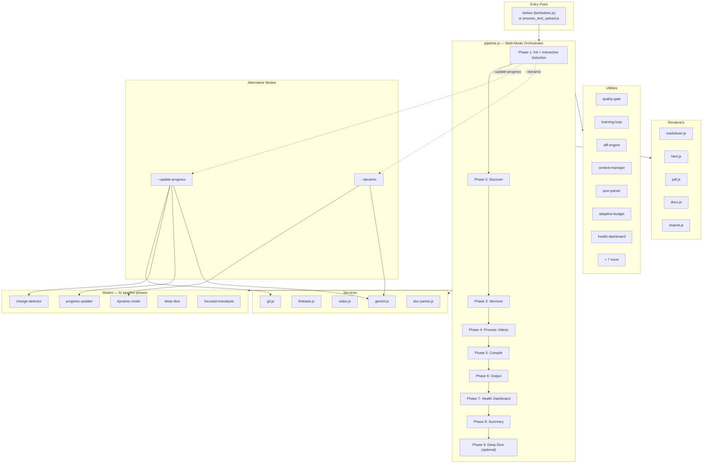

### Phase Descriptions

| Phase | Name | What Happens |
|-------|------|-------------|
| 1 | **Init** | CLI parsing, interactive folder selection (if no arg), config validation, logger setup, load learning insights, route to dynamic/progress mode |
| 2 | **Discover** | Find videos/audio, discover documents, resolve user name, check resume state |
| 3 | **Services** | Firebase auth, Gemini init, prepare document parts |
| 3.5 | **Deep Summary** | (optional) Pre-summarize context docs with Gemini — 60-80% token savings |
| 4 | **Process** | Compress → Upload → Analyze → Quality Gate → Retry → Focused Pass |
| 5 | **Compile** | Cross-segment compilation, diff engine comparison |
| 6 | **Output** | Write JSON, render Markdown + HTML, upload to Firebase |
| 7 | **Health** | Quality metrics dashboard, cost breakdown |
| 8 | **Summary** | Save learning history, print run summary |
| 9 | **Deep Dive** | (optional, `--deep-dive`) Topic discovery + explanatory document generation |

---

## Pipeline Phases

```mermaid
flowchart LR
    subgraph P1["Phase 1: Init"]
        CLI["Parse CLI args"]
        CFG["Validate config"]
        LOG["Init logger"]
        LRN["Load learning history"]
    end

    subgraph P2["Phase 2: Discover"]
        VID["Find videos"]
        DOC["Find documents"]
        USR["Resolve user name"]
    end

    subgraph P3["Phase 3: Services"]
        FB["Firebase auth"]
        AI["Gemini init"]
        DPR["Prepare docs"]
    end

    subgraph P4["Phase 4: Process"]
        CMP["Compress"]
        UPL["Upload"]
        ANZ["Analyze"]
        QG["Quality Gate"]
        RTY["Retry"]
        FOC["Focused Pass"]
    end

    subgraph P5["Phase 5: Compile"]
        CFL["Final Compilation"]
        DIF["Diff Engine"]
    end

    subgraph P6["Phase 6: Output"]
        JSON["results.json"]
        MDR["results.md"]
        HTMLR["results.html"]
        FBU["Firebase upload"]
    end

    subgraph P7["Phase 7: Health"]
        HD["Health Dashboard"]
    end

    subgraph P8["Phase 8: Summary"]
        SAV["Save learning history"]
        SUM["Print summary"]
    end

    P1 --> P2 --> P3 --> P4 --> P5 --> P6 --> P7 --> P8
```

---

## Per-Segment Processing

Each video segment goes through this flow (Phase 4 detail):

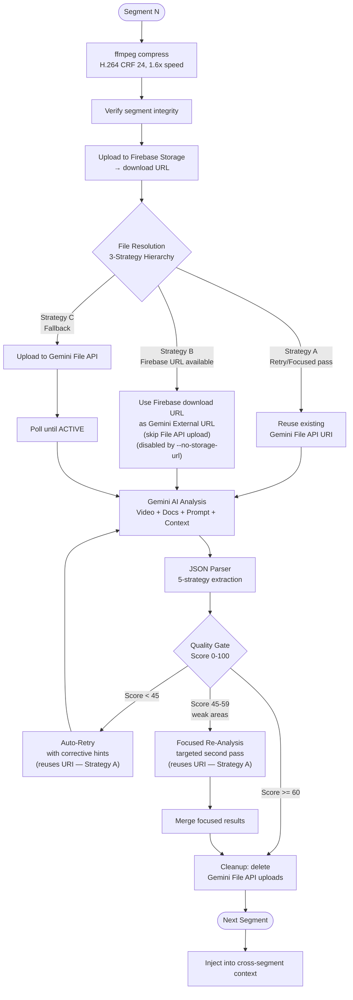

### File Resolution Strategies

The pipeline uses a 3-strategy hierarchy to avoid redundant uploads:

| Strategy | When Used | What Happens | Benefit |
|----------|-----------|-------------|---------|
| **A: Reuse URI** | Retry or focused re-analysis pass | Uses the Gemini File API URI or External URL from the first analysis | Zero upload — instant |
| **B: Storage URL** | Firebase upload succeeded, segment available via HTTPS | Uses the Firebase Storage download URL directly as a Gemini External URL | Skips Gemini File API upload + polling entirely |
| **C: File API Upload** | Fallback (no Firebase, `--skip-upload`, `--no-storage-url`, etc.) | Uploads to Gemini File API, polls until ACTIVE | Full upload + processing wait |

After all passes complete, any Gemini File API uploads are cleaned up (fire-and-forget delete). When Strategy B was used, no cleanup is needed since no Gemini file was created.

> **Upload control flags:** Use `--force-upload` to re-upload segments/documents even if they already exist in Firebase Storage. Use `--no-storage-url` to disable Strategy B and force Gemini File API uploads (Strategy C).

### Quality Gate Decision Table

| Score | Action |
|-------|--------|
| < 45 | Auto-retry with corrective hints |
| 45–59 with ≥2 weak dimensions | Focused re-analysis on weak areas |
| ≥ 60 | Pass |

---

## Multi-Segment Batching

When the Gemini context window has enough headroom, consecutive video segments are grouped into single API calls. This reduces the number of Gemini calls and gives the model better cross-segment awareness.

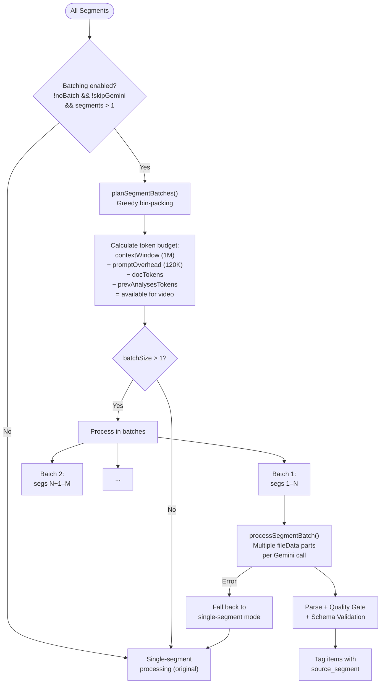

### How It Works

| Step | Detail |
| ------ | -------- |
| **Token budget** | `contextWindow − 120K overhead − docTokens − prevAnalysesTokens = available` |
| **Video cost** | ~300 tokens/sec × segment duration |
| **Bin-packing** | Greedy: add consecutive segments until budget or max batch size (8) reached |
| **Deep summary synergy** | Deep summary frees 60–80% of doc tokens → more room for video → larger batches |
| **Fallback** | Any batch failure → entire remaining file falls back to single-segment processing |
| **Cache aware** | Cached segment runs are loaded from disk; only uncached batches hit the API |
| **Disable** | `--no-batch` forces original single-segment behavior |

### Token Math Example

| Scenario | Doc Tokens | Available | Seg Duration | Tokens/Seg | Batch Size |
| ---------- | ----------- | ----------- | ------------- | ----------- | ----------- |
| No deep summary | 300K | ~580K | 280s | 84K | 6 |
| With deep summary | 60K | ~820K | 280s | 84K | 9 |
| Raw mode | 60K | ~820K | 1200s | 360K | 2 |

---

## Smart Change Detection

The `--update-progress` mode tracks which extracted items have been addressed:

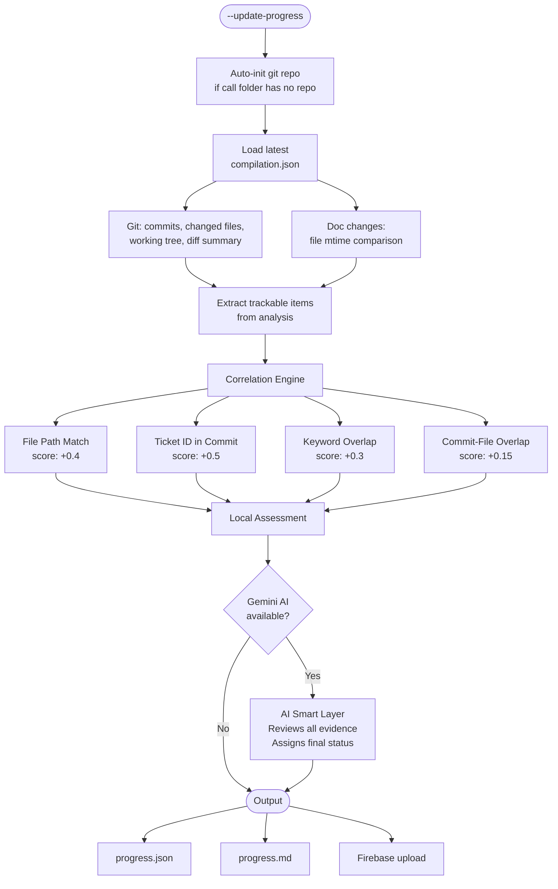

### Correlation Strategies

| Strategy | Score Contribution | How It Works |
|----------|--------------------|-------------|
| **File Path Match** | +0.4 | Git changed files match file paths mentioned in analysis items |
| **Ticket ID in Commit** | +0.5 | Commit messages contain ticket IDs from extracted items |
| **Keyword Overlap** | +0.3 | Keywords from item descriptions appear in commit messages or file names |
| **Commit-File Overlap** | +0.15 | Files touched in commits overlap with files referenced across items |

### Assessment Thresholds

| Correlation Score | Status Assigned |
|-------------------|----------------|
| ≥ 0.6 | **DONE** ✅ |
| ≥ 0.25 | **IN_PROGRESS** 🔄 |
| < 0.25 | **NOT_STARTED** ⏳ |
| *(AI override)* | **SUPERSEDED** 🔀 |

---

## Extraction Schema

The AI extracts 6 structured categories from any content source (video, audio, documents, or mixed). The prompt auto-detects the input type and adapts: temporal content (video/audio) gets timestamps; document-only content uses section references and null timestamps. All field names remain identical regardless of input type for backward compatibility.

### Categories

| Category | Key Fields | Adapts To |
|----------|-----------|----------|
| **Tickets / Items** | `ticket_id`, `title`, `status`, `assignee`, `reviewer`, `video_segments` with timestamps (or null for docs), `speaker_comments`, `details` with priority, confidence | Sprint items, requirements, interview topics, incident items, legal matters, deals |
| **Change Requests** | `WHERE` (target: file, system, process, scope), `WHAT` (specific change), `HOW` (approach), `WHY` (justification), `dependencies`, `blocked_by`, confidence | Code changes, requirement changes, process changes, scope adjustments, contract revisions, policy updates |
| **References** | `name`, `type`, `role`, cross-refs to tickets & CRs, `context_doc_match` | Files, documents, URLs, tools, systems, resources, contracts, reports mentioned |
| **Action Items** | `description`, `assigned_to`, `status`, `deadline`, `dependencies`, related tickets & CRs, confidence | Any follow-up work discussed or documented |
| **Blockers** | `description`, `severity`, `owner`, `status`, `proposed_resolution`, confidence | Technical blockers, approval gates, resource constraints, legal reviews, budget approvals |
| **Scope Changes** | `type` (added/removed/deferred), `original` vs `new` scope, `decided_by`, `impact`, confidence | Feature scope, project scope, contract scope, training scope |

### Personalized Task Section

Every analysis includes a `your_tasks` section scoped to the `--name` user:

| Field | Description |
|-------|-------------|
| `owned_tickets` | Items assigned to you |
| `tasks_todo` | Action items with priority |
| `waiting_on_others` | Items blocked on other people |
| `decisions_needed` | Things you need to decide |
| `completed_in_call` | Items resolved during the meeting |

### Confidence Scoring

Every extracted item carries a confidence rating:

| Level | Criteria | Example |
|-------|----------|---------|
| **HIGH** | Explicitly stated + corroborated | "Mentioned with ticket ID in VTT and task docs" |
| **MEDIUM** | Partially stated or single-source | "Discussed verbally, no written reference" |
| **LOW** | Inferred from context | "Implied from related discussion" |

---

## JSON Parser — 5-Strategy Extraction

Gemini output is unpredictable. The parser handles it with cascading strategies:

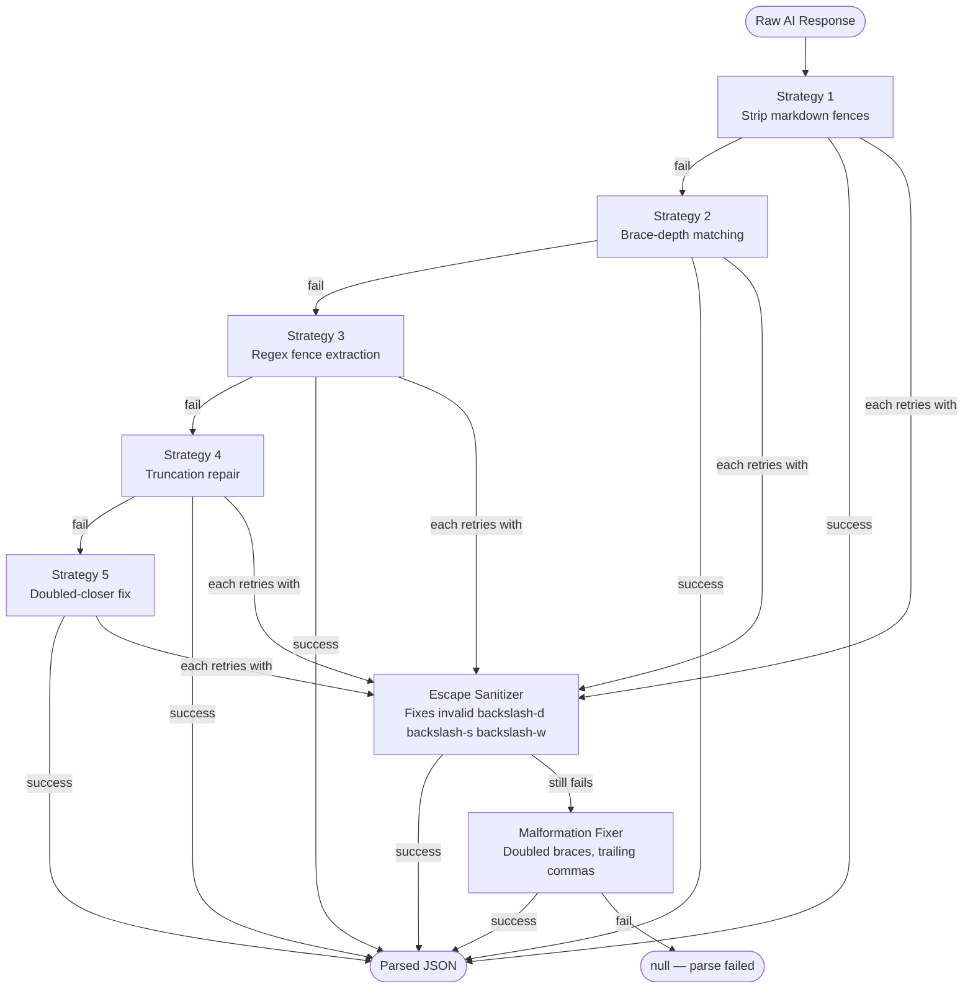

Each strategy is tried in order. If a strategy fails, it falls through to the next. After each strategy, a sanitizer pass is attempted. This achieves >99% parse success on real Gemini output.

---

## Quality Gate — 4-Dimension Scoring

| Dimension | Weight | What It Measures |
|-----------|--------|------------------|
| **Density** | 30% | Items extracted per minute of video |
| **Structure** | 25% | Required fields present (IDs, assignees, statuses) |
| **Confidence** | 25% | Confidence field coverage + calibration (not all HIGH) |
| **Cross-References** | 20% | Tickets linked to CRs, files referenced, action items connected |

The weighted sum yields a score 0–100. Low scores trigger automatic retry or focused re-analysis.

---

## Learning Loop — Self-Improving Budgets

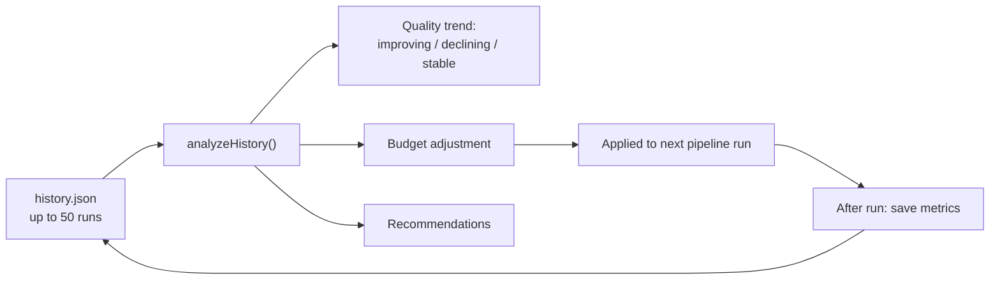

| Condition | Adjustment |
|-----------|-----------|
| Avg quality < 45 | +4096 thinking tokens |
| Avg quality > 80 | -2048 thinking tokens (save cost) |
| Quality stable | No change |

---

## Cross-Segment Continuity

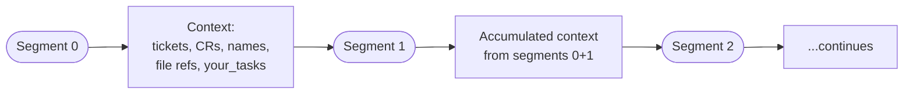

Each segment receives the full accumulated context from all prior segments. This ensures:
- Topic IDs mentioned in segment 0 are recognized in segment 3
- CR numbering is consistent across the entire recording
- Speaker names are resolved once and carried forward

---

## Diff Engine — Cross-Run Intelligence

When a previous run exists, the diff engine compares:

| Category | Detection |
|----------|-----------|
| **New items** | Present in current, absent in previous |
| **Resolved items** | Present in previous, absent in current |
| **Changed items** | Same ID but different status, assignee, or description |
| **Stable items** | Unchanged across runs |

This is useful when re-running analysis after updating documents — the diff shows exactly what the AI extracted differently.

---

## Deep Dive Mode

The `--deep-dive` flag triggers an additional phase after the main video analysis pipeline:

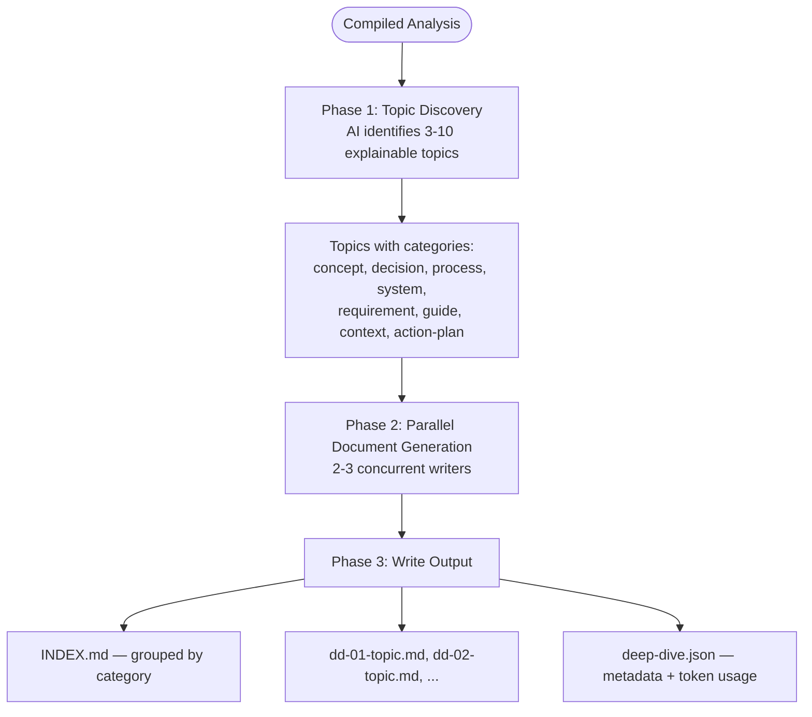

Deep dive runs AFTER the standard 8-phase pipeline completes, using the compiled analysis as input. Each topic document is self-contained (200-800 words) and written for someone who wasn't on the call.

---

## Dynamic Mode

The `--dynamic` flag routes to an entirely separate pipeline that works without video:

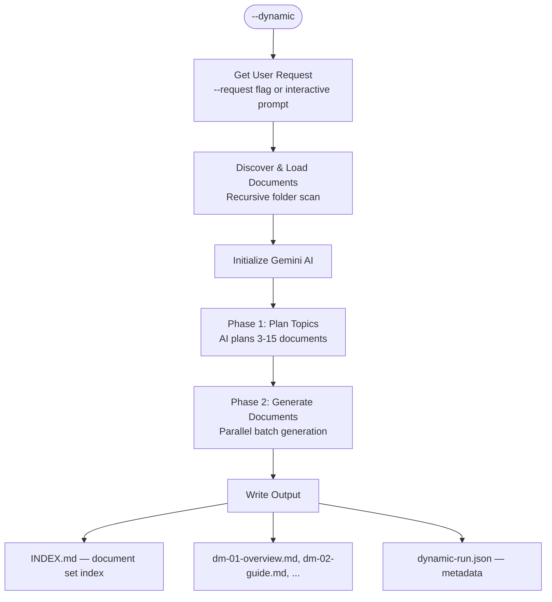

### Dynamic Mode Categories

| Category | Purpose | When Used |
|----------|---------|-----------|
| **overview** | High-level summaries, introductions | Always first document |
| **guide** | Step-by-step instructions, tutorials | How-to requests |
| **analysis** | Comparisons, evaluations, assessments | Analysis/research requests |
| **plan** | Roadmaps, timelines, strategies | Planning requests |
| **reference** | Specifications, API docs, schemas | Documentation requests |
| **concept** | Explanations, definitions, theory | Learning/teaching requests |
| **decision** | Decision records, trade-off evaluations | Architecture decisions |
| **checklist** | Verification lists, audit documents | Process/compliance requests |
| **template** | Reusable patterns, scaffolds | Template requests |
| **report** | Status reports, findings summaries | Reporting requests |

Dynamic mode accepts any request — the AI adapts document categories and count to match what's needed:

```bash
# Migration planning → plan + guide + checklist + risk analysis
taskex --dynamic --request "Plan migration from MySQL to PostgreSQL"

# Learning → concept + guide + reference (progressive complexity)
taskex --dynamic --request "Create React hooks tutorial"

# Architecture → overview + system docs + decision records
taskex --dynamic --request "Document this microservices architecture"
```

---

## Document Context Processing

| Extension | Method | Description |
|-----------|--------|-------------|
| `.vtt` `.srt` `.txt` `.md` `.csv` | Inline text | Read and passed directly as text parts |
| `.pdf` | Gemini File API | Uploaded as binary, Gemini processes natively |
| `.mp3` `.wav` `.ogg` `.m4a` | Gemini File API | Uploaded as audio, Gemini processes natively |
| `.docx` | Doc parser (mammoth) | Converted to plain text, sent as inline text |
| `.xlsx` `.xls` | Doc parser (xlsx) | Converted to pipe-delimited tables, sent as inline text |
| `.doc` `.pptx` `.ppt` `.odt` `.odp` `.ods` `.rtf` `.epub` | Doc parser (officeparser) | Converted to plain text, sent as inline text |
| `.html` `.htm` | Doc parser (built-in) | HTML tags stripped, sent as inline text |

Directories skipped during recursive discovery: `node_modules`, `.git`, `compressed`, `logs`, `gemini_runs`, `runs`

---

## Skip Logic / Caching

| Stage | Skip Condition |
|-------|----------------|
| **Compression** | `compressed/{video}/segment_*.mp4` exist on disk |
| **No-compress split** | `--no-compress` flag: raw keyframe split via `ffmpeg -c copy` (no re-encoding) |
| **Firebase upload** | File already exists at `calls/{name}/segments/{video}/` (bypassed by `--force-upload`) |
| **Storage URL → Gemini** | Firebase download URL available (bypassed by `--no-storage-url`) |
| **Gemini analysis** | Run file exists in `gemini_runs/` AND user chooses not to re-analyze |

---

## Logging

Every run creates three log files in `logs/`:

| File | Contents |
|------|----------|
| **Detailed** (`_detailed.log`) | All console output, debug info, response previews, timestamps |
| **Minimal** (`_minimal.log`) | Steps, info, warnings, errors + timestamps (no debug) |
| **Structured** (`_structured.jsonl`) | Every event as a JSON object with level, timestamp, context, phase |

Log levels: `STEP` (milestones) · `INFO` (verbose) · `WARN` (non-fatal) · `ERR` (failures) · `DBG` (debug data)

JSONL structured format includes phase spans with timing metrics for observability.

---

## Tech Stack

| Component | Package | Purpose |
|-----------|---------|---------|
| **Node.js** | ≥ 18.0.0 | Runtime (v24 tested) |
| **Gemini AI** | `@google/genai@^1.42.0` | Video analysis, File API, 1M context window |
| **Firebase** | `firebase@^12.9.0` | Anonymous auth + Cloud Storage uploads |
| **dotenv** | `dotenv@^17.3.1` | Environment variable loading |
| **puppeteer** | `puppeteer` | HTML → PDF conversion for PDF output format |
| **docx** | `docx` | Programmatic Word document generation for DOCX output format |
| **mammoth** | `mammoth` | DOCX → plain text conversion |
| **xlsx** | `xlsx` | Excel spreadsheet parsing (XLSX/XLS) |
| **officeparser** | `officeparser` | DOC, PPTX, ODT, RTF, EPUB text extraction |
| **ffmpeg** | System binary | H.264 video compression + segmentation |
| **Git** | System binary | Change detection for progress tracking |

**Codebase: ~48 files · ~13,600+ lines** · npm package: `task-summary-extractor` · CLI: `taskex`

---

## Video Encoding Parameters

| Parameter | Value | Purpose |
|-----------|-------|---------|
| Codec | H.264 (libx264) | Universal compatibility |
| CRF | 24 (screenshare) / 20 (4K) | Quality-size balance |
| Tune | `stillimage` | Optimized for screen content |
| Sharpening | `unsharp=3:3:0.3` | Preserve text clarity |
| x264 params | `aq-mode=3:deblock=-1,-1:psy-rd=1.0,0.0` | Text readability |
| Audio | AAC, 64–128k, original sample rate | Clear speech |
| Speed | 1.6× default (`--speed` flag, env `VIDEO_SPEED`) | Reduce tokens per segment |
| Segment Duration | 280s default, compress mode only (`--segment-time` flag) | Context budget per segment |
| No-Compress Mode | Off by default (`--no-compress` flag) | Stream-copy split at 1200s (20 min), no re-encoding |

> **Google Gemini constraints:** ~300 tokens/sec (default res), ~100 tok/sec (low res). File API: 2 GB/file (free), 20 GB (paid). Max ~1 hour at default res per 1M context window.

---

## Gemini Run Record Format

Each segment analysis is saved as a timestamped JSON file:

```json
{
  "run": {
    "model": "gemini-2.5-flash",
    "displayName": "my-meeting_Recording_seg00",
    "userName": "Jane Smith",
    "timestamp": "2026-02-23T17:39:50.123Z",
    "durationMs": 45230
  },
  "input": {
    "videoFile": {
      "mimeType": "video/mp4",
      "fileUri": "...",
      "geminiFileName": "files/abc123",
      "usedExternalUrl": false
    },
    "contextDocuments": [{ "fileName": ".tasks/requirements.md" }],
    "previousSegmentCount": 0
  },
  "output": {
    "raw": "{ ... full AI response ... }",
    "parsed": { "tickets": [], "change_requests": [] },
    "parseSuccess": true
  }
}
```

When `usedExternalUrl` is `true`, the `fileUri` contains the Firebase Storage download URL and `geminiFileName` is `null` (no File API upload was made).

---

## JSON Schema Validation

All AI output is validated against JSON Schema definitions in `src/schemas/`:

| Schema | File | Purpose |
|--------|------|---------|
| Segment analysis | `analysis-segment.schema.json` | Validates each segment's extracted data |
| Compiled analysis | `analysis-compiled.schema.json` | Validates the final cross-segment compilation |

Validation is performed by `src/utils/schema-validator.js` using [ajv](https://ajv.js.org/). Validation errors are reported as warnings with contextual hints for the retry/focused-pass cycle — they do not hard-fail the pipeline but are injected as corrective hints when the quality gate triggers a retry.

---

## Test Suite

The project includes a comprehensive test suite using [vitest](https://vitest.dev/):

| Metric | Value |
|--------|-------|
| Test files | 15 |
| Total tests | 331 |
| Framework | vitest v4.x |
| Coverage | `@vitest/coverage-v8` |

**Test categories:**

| Directory | What's Tested |
|-----------|---------------|
| `tests/utils/` | Utility modules: adaptive-budget, cli, confidence-filter, context-manager, diff-engine, format, json-parser, progress-bar, quality-gate, retry, schema-validator |
| `tests/renderers/` | Renderer modules: html, markdown |

**Commands:**

```bash
npm test              # Run all tests
npm run test:watch    # Watch mode
npm run test:coverage # Coverage report
```

---

## See Also

| Doc | What's In It |
|-----|-------------|
| 📖 [README.md](README.md) | Setup, CLI flags, configuration, features |
| 📖 [QUICK_START.md](QUICK_START.md) | Step-by-step first-time walkthrough |

---

## Deep Summary

The `--deep-summary` flag (or interactive prompt when many docs are detected) pre-summarizes context documents before segment analysis:

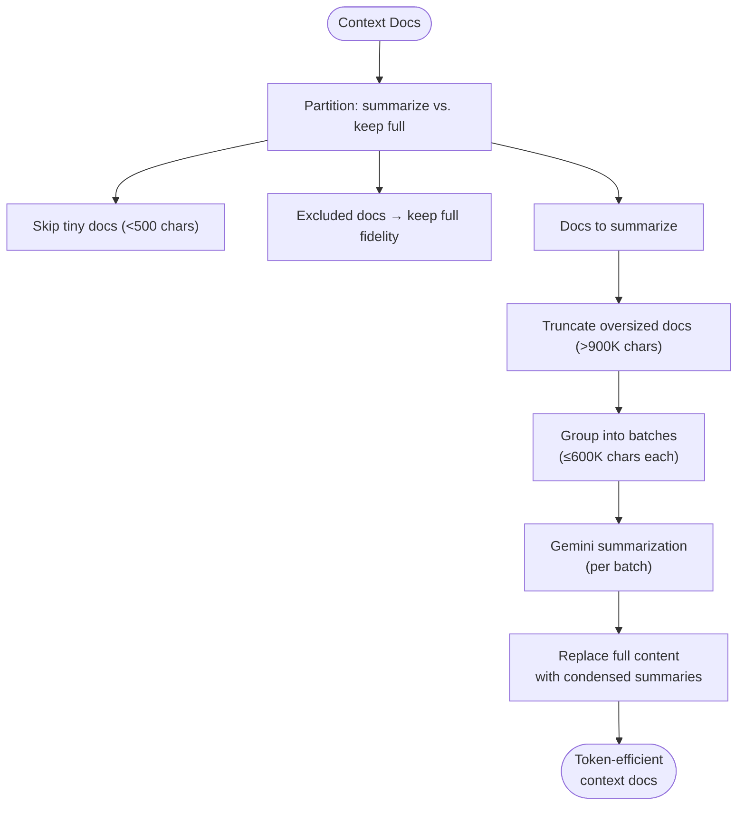

| Constant | Value | Purpose |
|----------|-------|---------|
| `BATCH_MAX_CHARS` | 600,000 | Max input chars per summarization batch |
| `MAX_DOC_CHARS` | 900,000 | Hard cap per-document before truncation |
| `SUMMARY_MAX_OUTPUT` | 16,384 | Max output tokens per summarization call |
| `MIN_SUMMARIZE_LENGTH` | 500 | Docs below this skip summarization |

Typical savings: 60-80% reduction in per-segment context tokens. The user can exclude specific docs from summarization via `--exclude-docs` or the interactive picker.

---

## Context Window Safety

Safeguards to prevent context window overflow:

| Safeguard | Where | What It Does |
|-----------|-------|-------------|
| **P0/P1 hard cap** | `context-manager.js` | Critical docs can't exceed 2× the token budget |
| **VTT fallback cap** | `context-manager.js` | Full VTT fallback capped at 500K chars |
| **Doc truncation** | `deep-summary.js` | Oversized docs truncated to 900K chars before summarization |
| **Compilation pre-flight** | `gemini.js` | Estimates tokens before compilation; trims middle segments if >80% of context |
| **RESOURCE_EXHAUSTED recovery** | `gemini.js` | On quota/context errors: waits 30s, sheds docs, retries with reduced input |
